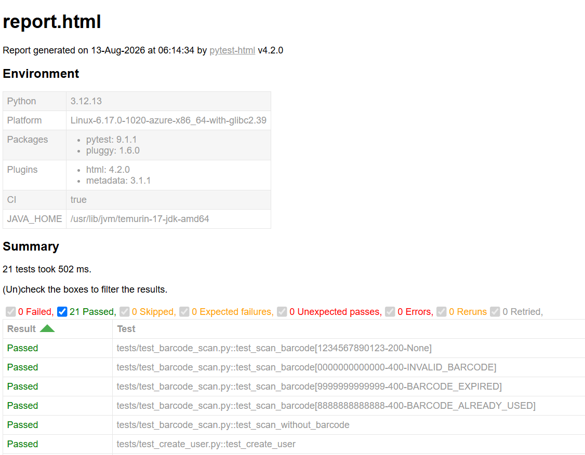
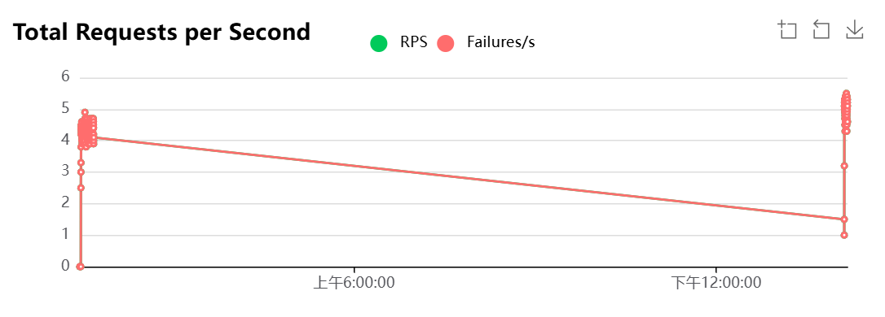
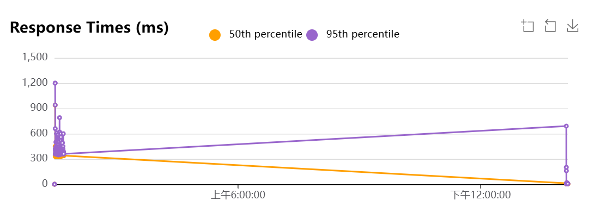
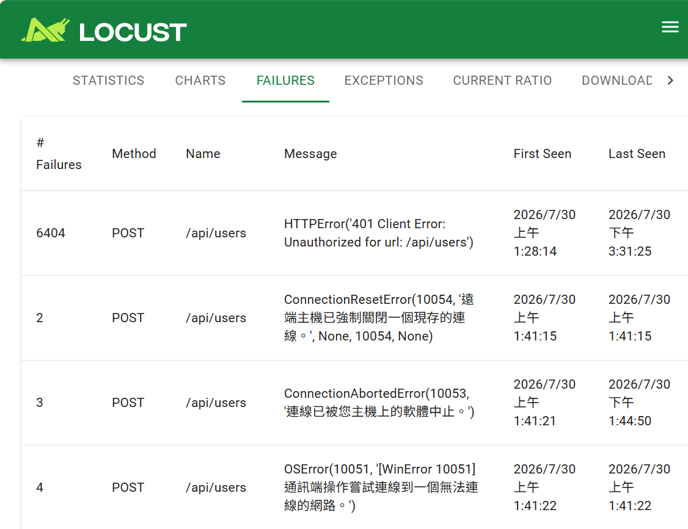

# API Automation & Performance Testing


This project demonstrates REST API automation testing and performance testing using Python. It covers functional validation with Pytest and load testing with Locust, showcasing a complete API testing workflow.

## Features

✔ REST API Automation

✔ CRUD API Testing

✔ Modular API Client

✔ Pytest Fixtures

✔ Test Data Management

✔ HTTP Status Code Validation

✔ Response Data Validation

✔ HTML Test Report with pytest-html

✔ Performance Testing with Locust

✔ GitHub Actions CI

✔ HTML Test Report 

✔ Automated GitHub Release

✔ CI/CD Workflow

✔ Git-based Version Control

## 🛠 Technologies
| Category | Technology |
|----------|------------|
| Language | Python 3 |
| Testing | Requests |
| Test Framework | Pytest |
| Test Architecture | API Client / Fixtures | 
| Test Reporting | pytest-html |
| Performance | Locust |
| CI/CD | GitHub Actions |
| Version Control | Git,GitHub |

## 📂 Project Structure


```text
API_Testing/
│
├── .github/
│   └── workflows/
│       ├── ci.yml
│       └── release.yml
├── api/
│   └── api_client.py
│
├── config/
│   └── config.py
│
├── data/
│   └── test_data.py
│
├── tests/
│   ├── test_get_user.py
│   ├── test_create_user.py
│   ├── test_update_user.py
│   ├── test_delete_user.py
│   └── test_parameter.py
│
├── reports/
│   ├── screenshot/
│   │   └── pytest_html_report.png
│   └── ...
│
├── screenshots/
│   ├── locust_failure_rate.png
│   ├── locust_response_time.png
│   └── locust_rps.png
│
├── locust-performance-testing/
│   ├── locustfile.py
│   ├── requirements.txt
│   └── README.md
│
├── conftest.py
├── pytest.ini
├── requirements.txt
└── README.md
```

Generated reports and temporary files are excluded from source control through .gitignore.

## 🏗 Architecture
###  API Automation
```text
                 Pytest Test Cases
                         │
                         ▼
                API Client Requests
                         │
                         ▼
                      REST API
                         │
                         ▼
                Response Validation
                         │
                         ▼
                     Assertions
                         │
                         ▼
                     pytest-html
                         │
                         ▼
                     HTML Report
```
### Performance Testing
```text
                 Locust Test Script
                         │
                         ▼
                      REST API
                         │
                         ▼
                Concurrent Requests
                         │
                         ▼
              Performance Measurements
                         │
              ┌──────────┼──────────┐
              ▼          ▼          ▼
             RPS    Response Time   Failures
```

### CI/CD Pipeline
```text                            
            Push / Pull Request          
                    │
                    ▼
             GitHub Actions CI
                    │
                    ▼
               Setup Python
                    │
                    ▼
           Install Dependencies
                    │
                    ▼
                Run Pytest
                    │
        ┌───────────────────────┐
        ▼                       ▼
    Test Pass               Test Fail
        │                       │
        ▼                       ▼
Generate HTML Report       Stop Pipeline
        │
        ▼
Upload Report Artifact


          Manual Release Trigger
                    │
                    ▼
            GitHub Actions CD
                    │
                    ▼
               Run Pytest
                    │
                    ▼
                Test Pass
                    │
                    ▼
          Create GitHub Release         
```


## 🚀 API Automation Testing
### Test Coverage

The API automation suite currently covers the following operations:

| Method | Test Coverage |
| ------ | ------------- |
| GET |	Retrieve user data |
| POST | Create a new user |
| PUT |	Update user data |
| DELETE | Delete user |
---


###  API Endpoints

| Method | Endpoint | Description |
|--------|----------|-------------|
| GET | /api/users?page=2 | Retrieve user list |
| POST | /api/users | Create a new user |
| PUT | /api/users/2 | Update user |
| DELETE | /api/users/2 | Delete user |
---

## ✅ Test Result Summary

| Item | Result |
|------|--------|
| Total Tests | 7 |
| Passed | 7 |
| Failed | 0 |
| Success Rate | 100% |
| Execution Time | ~7.5 sec |

> Test execution time may vary depending on API response time and network conditions.

## 📄 HTML Test Report

The project uses pytest-html to generate a self-contained HTML test report.

### Run Tests

```bash
pytest --html=reports/report.html --self-contained-html
```
The generated report contains:

- Total test cases
- Passed tests
- Failed tests
- Error information
- Test execution duration
- Test case details

### Report Screenshot


---
## 🔄 Continuous Integration

The project uses GitHub Actions to automatically execute the API test suite on every push and pull request targeting the main branch.

### CI Workflow

The CI pipeline is defined in:

```text
.github/workflows/ci.yml
```
The workflow automatically:

- Runs on push and pull request events targeting main
- Sets up Python 3.12
- Installs project dependencies
- Executes the API test suite
- Generates a self-contained HTML test report
- Uploads the report as a GitHub Actions artifact
- Preserves the report even when tests fail

### CI Test Workflow
```text
       Push / Pull Request
                │
                ▼
       Checkout Repository
                │
                ▼
        Setup Python 3.12
                │
                ▼
       Install Dependencies
                │
                ▼
     Create Reports Directory
                │
                ▼
            Run Pytest
                |
        ┌───────────────┐
        ▼               ▼
    Test Pass       Test Fail
        │               │
        └───────┬───────┘
                ▼
        Generate HTML Report
                │
                ▼
        Upload Report Artifact
```


## 📦 CI Test Report Artifact

The generated HTML report is uploaded to GitHub Actions as a workflow artifact.
```text
           GitHub Actions
                 │
                 ▼
               pytest
                 │
                 ▼
         reports/report.html
                 │
                 ▼
           Upload Artifact
                 │
                 ▼
           api-test-report
```
The artifact allows test results to be inspected after the CI workflow completes without committing generated reports to the repository.

###  Artifact
```text
api-test-report
└── report.html
```
The report can be downloaded from:
```
GitHub → Actions → API Automation Tests → Artifacts
```
The HTML report is uploaded with if: always() so that the report remains available even when one or more API tests fail.

## 🚀 Continuous Delivery

The project includes a GitHub Actions release workflow for automated GitHub Releases.

### CD Workflow

The release workflow is defined in:

```text
.github/workflows/release.yml
```
The release pipeline:

- Is triggered manually through GitHub Actions
- Sets up Python 3.12
- Installs project dependencies
- Runs the API test suite
- Creates a GitHub Release when all tests pass

### Release Flow
```text
Manual Release Trigger
        │
        ▼
GitHub Actions CD
        │
        ▼
Setup Python 3.12
        │
        ▼
Install Dependencies
        │
        ▼
   Run Pytest
        │
        ▼
    Test Pass
        │
        ▼
Create GitHub Release
```

## ⚡ Performance Testing (Locust)

### Target API

```
https://reqres.in
```

### Test Scenario

- GET /api/users?page=2
- POST /api/users

Performance metrics include:

- Requests Per Second (RPS)
- Response Time
- Failure Rate
- Concurrent User Load
###  Run Locust
Navigate to the performance testing directory:
```bash
cd locust-performance-testing
```
Install dependencies:
```bash
pip install -r requirements.txt
```
Start Locust:
```bash
python -m locust -f locustfile.py
```

Open the Locust Web UI:

```
http://localhost:8089
```

Configuration

- Users: 10
- Spawn Rate: 2

---

## 📈 Performance Report


### Total Requests per Second



---
### Response Times



---

### Failure Rate



Performance results may vary depending on external API behavior, network conditions, and test load.

---
## 🔧 Installation
1. Clone the repository
```bash
git clone https://github.com/balla930510-cmd/api-automation-testing.git
```
2. Navigate to the project
```bash
cd API_Testing
```
3. Install dependencies
```bash
pip install -r requirements.txt
```
## ▶️ Run Tests

Run the complete API test suite:
```bash
pytest
```
Run tests with verbose output:
```bash
pytest -v
```
Generate HTML test report:
```bash
pytest --html=reports/report.html --self-contained-html
```
## 💻 Test Environment
| Item | Local | CI |
| ---- | ----- | -- |
| OS | Windows 11 | Ubuntu |
| Python | 3.13.9 | 3.12 |
| Test Framework | Pytest |	Pytest |
| API Library |	Requests |	Requests |
| HTML Report |　pytest-html | pytest-html |
| Performance |	Locust | — |
| CI/CD |— | GitHub Actions CI/CD|
---


## 👨‍💻 Author

Bai, Chen-Liang

Department of Mathematics
Information Mathematics Program

Fu Jen Catholic University
GitHub:
https://github.com/balla930510-cmd/api-automation-testing

Email:
balla930510@gmail.com

---

## 📄 License

This project is created for learning and portfolio purposes.

Copyright © 2026 Bai Chen-Liang. All rights reserved.